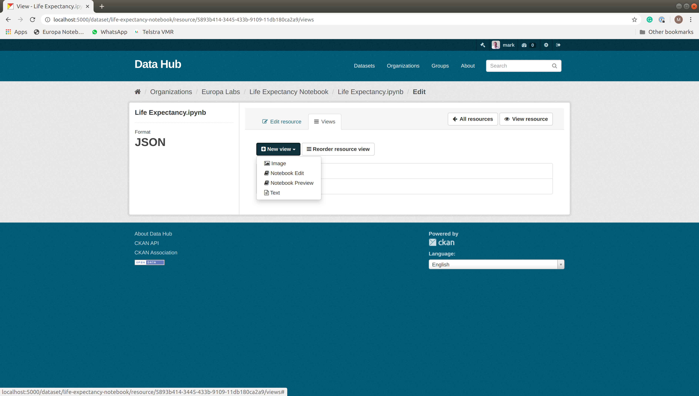
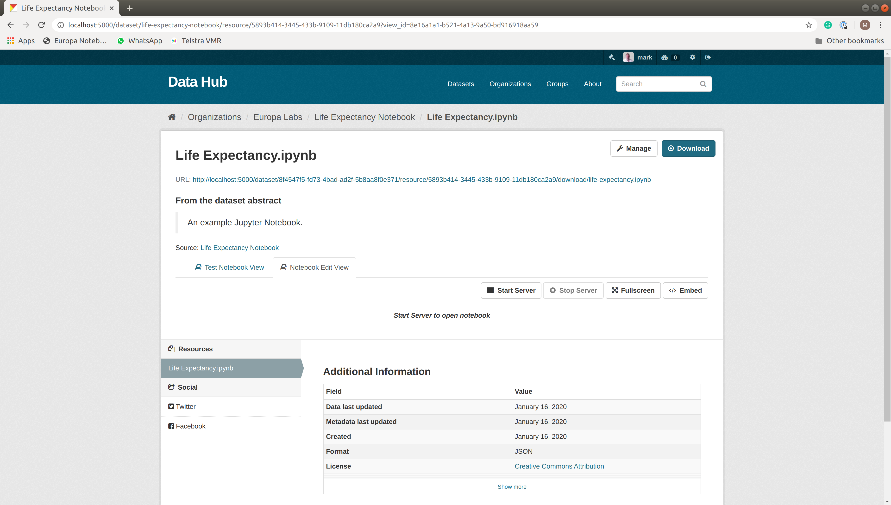
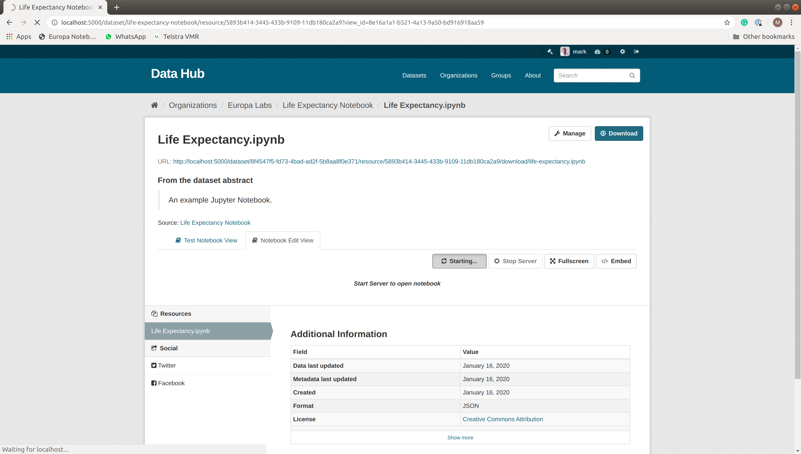
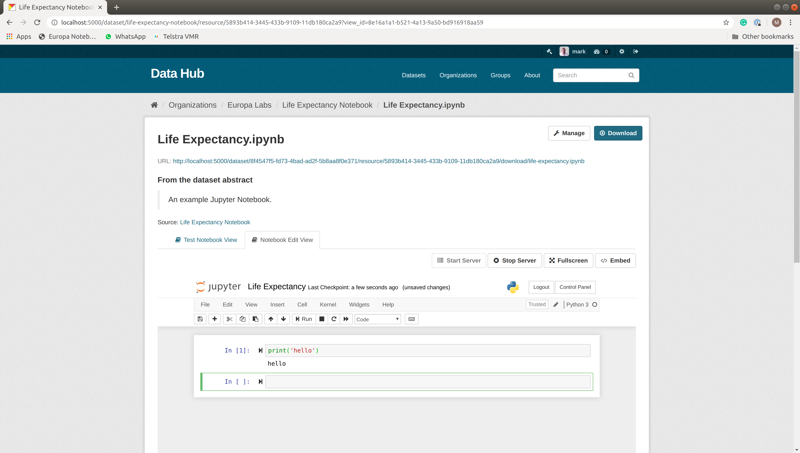
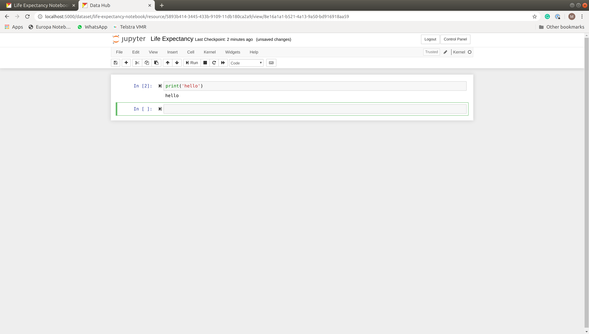
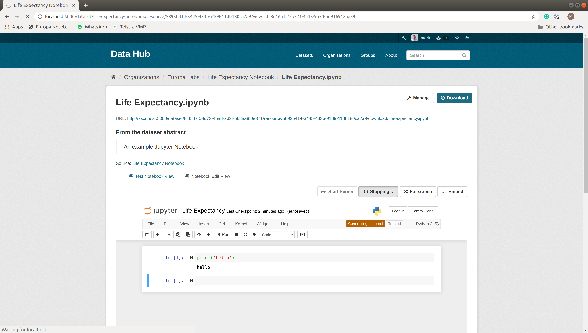
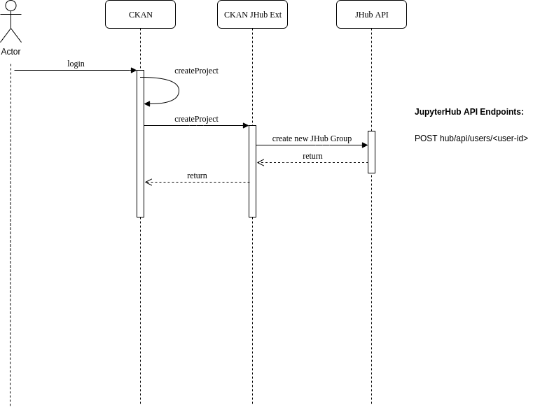
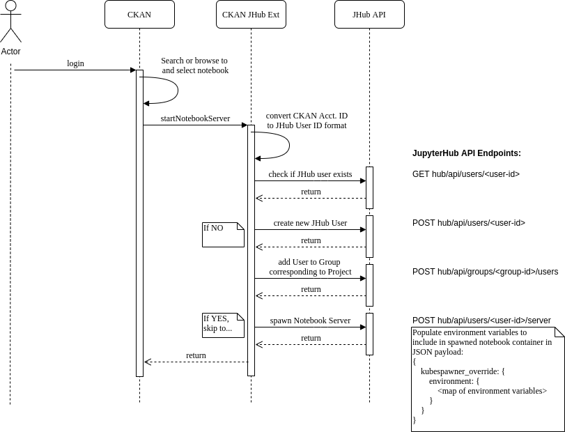

.. image:: https://travis-ci.org/markmo/ckanext-nbedit.svg?branch=master
    :target: https://travis-ci.org/markmo/ckanext-nbedit

.. image:: https://coveralls.io/repos/markmo/ckanext-nbedit/badge.svg
  :target: https://coveralls.io/r/markmo/ckanext-nbedit

..  .. image:: https://pypip.in/download/ckanext-nbedit/badge.svg
        :target: https://pypi.python.org/pypi//ckanext-nbedit/
        :alt: Downloads

..  .. image:: https://pypip.in/version/ckanext-nbedit/badge.svg
        :target: https://pypi.python.org/pypi/ckanext-nbedit/
        :alt: Latest Version

..  .. image:: https://pypip.in/py_versions/ckanext-nbedit/badge.svg
        :target: https://pypi.python.org/pypi/ckanext-nbedit/
        :alt: Supported Python versions

..  .. image:: https://pypip.in/status/ckanext-nbedit/badge.svg
        :target: https://pypi.python.org/pypi/ckanext-nbedit/
        :alt: Development Status

..  .. image:: https://pypip.in/license/ckanext-nbedit/badge.svg
        :target: https://pypi.python.org/pypi/ckanext-nbedit/
        :alt: License

=============
ckanext-nbedit
=============

A CKAN Resource View plugin to edit and run a Jupyter Notebook.

**Create Notebook Edit View**

**Start Server to Open Notebook**

**Starting...**

**Open Notebook**

**Open to Fullscreen**

**Stopping...**

------------
Requirements
------------

Tested with CKAN Version 2.8.3.

------------
Design Notes
------------

An API Token will be setup as a service account to JupyterHub.

A new CKAN Project will create a corresponding group in JupyterHub for
administrative and reporting purposes.

**Create Project Sequence Diagram**

Similarly, a CKAN User will match a corresponding JupyterHub User, 
automatically created.
A token will be requested for each user from the JupyterHub API, and
used to make subsequent requests to the spawned Jupyter Server on
behalf of the user in the CKAN session.

**Start Notebook Server Sequence Diagram**

------------
Installation
------------

To install ckanext-nbedit:

1. Activate your CKAN virtual environment, for example::

     . /usr/lib/ckan/default/bin/activate

2. Install the ckanext-nbedit Python package into your virtual environment::

     pip install ckanext-nbedit

3. Add ``nbedit`` to the ``ckan.plugins`` setting in your CKAN
   config file (by default the config file is located at
   ``/etc/ckan/default/production.ini``).

4. Restart CKAN. For example if you've deployed CKAN with Apache on Ubuntu::

     sudo service apache2 reload

   or for local development::

     paster serve --reload /etc/ckan/default/development.ini

---------------
Config Settings
---------------

The following config settings are required, e.g. in ``/etc/ckan/default/development.ini``
under ``[app:main]``::

    # The JupyterHub base url, just scheme, host and port. Leave off 
    # the trailing slash.
    ckanext.nbedit.jhub_url = http://192.168.99.101:31212

    # API token generated and put in the JupyterHub config file, e.g.
    #
    # hub:
    #   ...
    #   services:
    #     test:
    #       admin: true
    #       apiToken: 62b8ed0e59dca768f4ab782ebe0419558801e5c558c648da5f26e10cb1b7f289
    #
    ckanext.nbedit.jhub_token = 62b8ed0e59dca768f4ab782ebe0419558801e5c558c648da5f26e10cb1b7f289

    # Token expiry limit
    ckanext.nbedit.jhub_token_expiry_sec = 14400

    # The JupyterHub Public Proxy server to access Jupyter Notebooks
    ckanext.nbedit.jhub_public_proxy = http://192.168.99.100:31212

    # The Redis write host accessible from within the Kubernetes cluster
    ckanext.nbedit.jupyter_redis_host = redis-master.default.svc.cluster.local

    # The Redis password
    ckanext.nbedit.jupyter_redis_password = changme

    # Default content for a newly created notebook
    ckanext.nbedit.new_notebook_content = {"nbformat": 4, "nbformat_minor": 2, "metadata": {}, "cells": []}

    # Default filename for a newly created notebook
    ckanext.nbedit.new_notebook_filename = notebook.ipynb

------------------------
Development Installation
------------------------

To install ckanext-nbedit for development, activate your CKAN virtualenv and
do::

    git clone https://github.com/markmo/ckanext-nbedit.git
    cd ckanext-nbedit
    python setup.py develop
    pip install -r dev-requirements.txt

-----------------
Running the Tests
-----------------

To run the tests, do::

    nosetests --nologcapture --with-pylons=test.ini

To run the tests and produce a coverage report, first make sure you have
coverage installed in your virtualenv (``pip install coverage``) then run::

    nosetests --nologcapture --with-pylons=test.ini --with-coverage --cover-package=ckanext.nbedit --cover-inclusive --cover-erase --cover-tests

---------------------------------
To create package
---------------------------------

To create a source and wheel distribution::

  python setup.py sdist bdist_wheel

The artifacts are placed in ``dist/``.

---------------------------------
Setup dev instance of JupyterHub on Minikube
---------------------------------

Follow the instructions at https://github.com/markmo/jupyterhub-env.

---------------------------------
Install from this GitHub Repo
---------------------------------

ckanext-nbview can be installed using::

  pip install git+https://github.com/markmo/ckanext-nbedit#egg=ckanext-nbedit

---------------------------------
Registering ckanext-nbedit on PyPI
---------------------------------

ckanext-nbedit should be availabe on PyPI as
https://pypi.python.org/pypi/ckanext-nbedit. If that link doesn't work, then
you can register the project on PyPI for the first time by following these
steps:

1. Create a source distribution of the project::

     python setup.py sdist

2. Register the project::

     python setup.py register

3. Upload the source distribution to PyPI::

     python setup.py sdist upload

4. Tag the first release of the project on GitHub with the version number from
   the ``setup.py`` file. For example if the version number in ``setup.py`` is
   0.0.1 then do::

       git tag 0.0.1
       git push --tags

----------------------------------------
Releasing a New Version of ckanext-nbedit
----------------------------------------

ckanext-nbedit is availabe on PyPI as https://pypi.python.org/pypi/ckanext-nbedit.
To publish a new version to PyPI follow these steps:

1. Update the version number in the ``setup.py`` file.
   See `PEP 440 <http://legacy.python.org/dev/peps/pep-0440/#public-version-identifiers>`_
   for how to choose version numbers.

2. Create a source distribution of the new version::

     python setup.py sdist

3. Upload the source distribution to PyPI::

     python setup.py sdist upload

4. Tag the new release of the project on GitHub with the version number from
   the ``setup.py`` file. For example if the version number in ``setup.py`` is
   0.0.2 then do::

       git tag 0.0.2
       git push --tags
